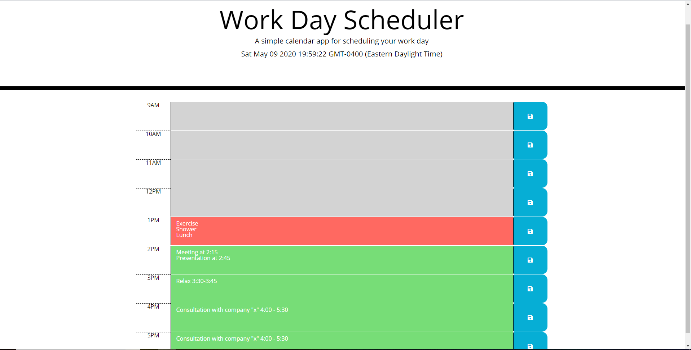

# DayPlanner
This is an app that will help anyone organize their time during a typical 9-5 work day. The current date and time is displayed at the top, while the bottom 
of the page is filled with color coded time blocks that can be filled with any sort of task that needs to be accomplished. Just fill in the task and click the save button to record any tasks that need to be completed throughout the day.

This was another challenging activity. I feel that I now have a better grasp on how localstorage works and can put it to better use in the future. Overall, I felt much better developing this application with javascript and jquery. I hope that I will begin to work through these challenging problems a bit more efficiently as I get more comfortable with JavaScript and jQuery. 
